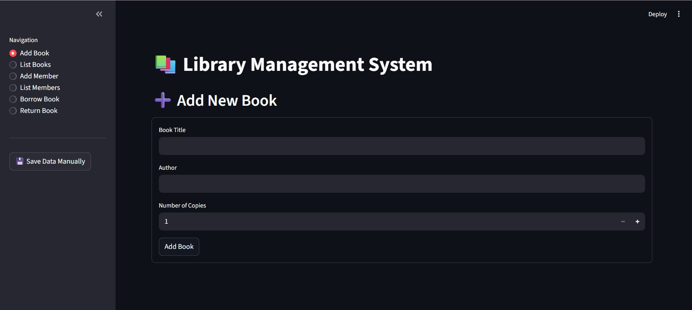

# 📚 Library Management System

A Python-based Library Management System with two interfaces: a **command-line (CLI)** version and a **Streamlit web UI**. Manage books, members, borrowing, and returns — all backed by a simple JSON database.

---

## ✨ Features

- 📖 **Add & list books** with title, author, and copy count
- 👤 **Register & list members** with name and email
- 📕 **Borrow books** — automatically tracks availability
- 📗 **Return books** — restores copy count instantly
- 💾 **JSON-based persistence** — no database setup required
- 🖥️ **Two interfaces** — terminal CLI or browser-based Streamlit UI

---

## 🖼️ Screenshot



---

## 📁 Project Structure

```
library-management-system/
├── main.py          # CLI version
├── stream.py        # Streamlit web UI version
├── library.json     # Auto-generated data file
└── README.md
```

---

## 🚀 Getting Started

### Prerequisites

- Python 3.7+
- pip

### Installation

```bash
git clone https://github.com/your-username/library-management-system.git
cd library-management-system
```

Install dependencies for the Streamlit version:

```bash
pip install streamlit
```

---

## 🖥️ Usage

### Option 1 — CLI (Terminal)

```bash
python main.py
```

You'll see an interactive menu:

```
==================================================
LIBRARY MANAGEMENT SYSTEM
==================================================
1. ADD BOOK
2. LIST BOOKS
3. ADD MEMBERS
4. LIST MEMBERS
5. BORROW BOOK
6. RETURN BOOK
0. EXIT FROM PORTAL
--------------------------------------------------
What Task You Want To Do =
```

### Option 2 — Streamlit Web UI

```bash
streamlit run stream.py
```

Then open your browser at `http://localhost:8501`

---

## 🗄️ Data Storage

All data is stored locally in `library.json`, auto-created on first run. Example structure:

```json
{
    "books": [
        {
            "id": "B-XYZ12",
            "title": "Book Title",
            "author": "Author Name",
            "total_copies": 5,
            "available_copies": 3,
            "added_on": "2026-05-10 13:00:00"
        }
    ],
    "members": [
        {
            "id": "M-ABC34",
            "name": "Member Name",
            "email": "member@email.com",
            "borrowed": []
        }
    ]
}
```

---

## 🛠️ How It Works

| Action | What Happens |
|---|---|
| Add Book | Generates unique ID, saves to JSON |
| Add Member | Generates unique member ID, saves to JSON |
| Borrow Book | Decrements `available_copies`, logs borrow entry to member |
| Return Book | Increments `available_copies`, removes entry from member |


